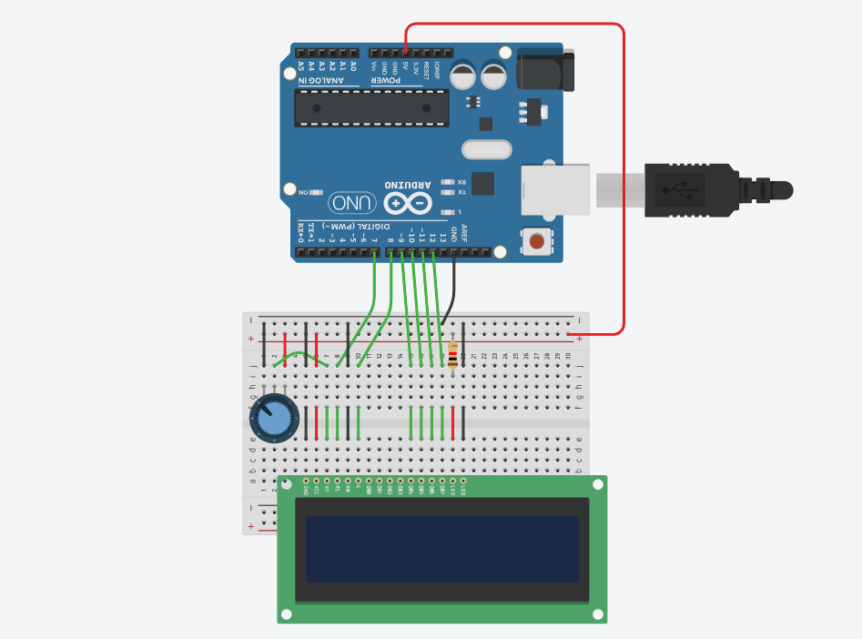
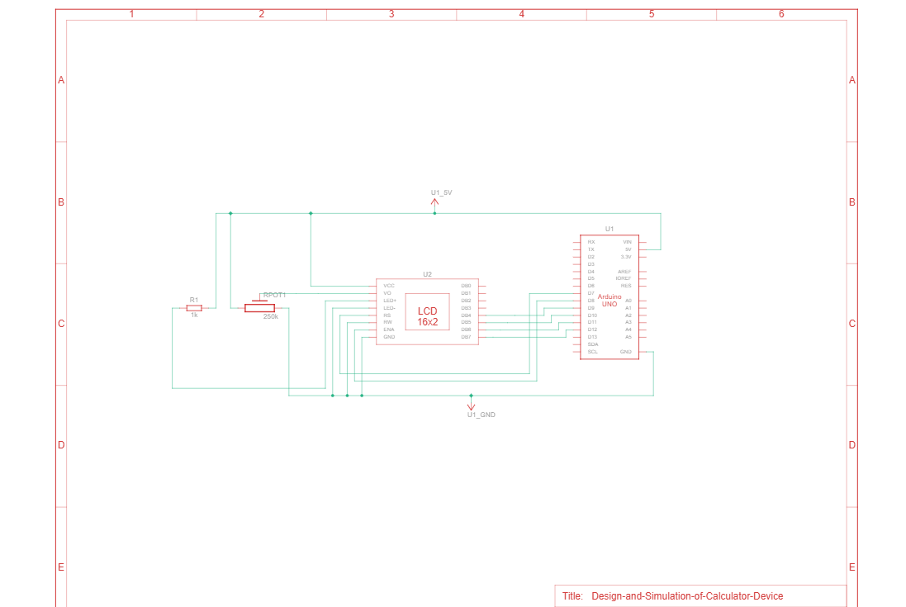
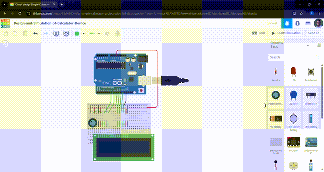

# 🧮 Design and Simulation of Portable Calculator Device
This repository contains the implementation of the project _"Design-and-Simulation-of-Portable-Calculator-Device"_ at the Department of Mechatronics Engineering (DOME), Federal University of Technology, Minna.

---

## 🔍 Project Objectives

---

## 🧰 Components Used

---

## 🌀 Working Principle

### 📷 Circuit Diagram

    
     
    <em> Circuit Diagram</em>

### 📷 Schematic Diagram

    
     
    <em> Schematic Diagram</em>

### 🎥 Demo

    
     
    <em> Simulation Demo</em>

---

## 📌 Note
Kindly [**click here**](program_script/calculator_simulation.ino) to access the full program script. 

---
